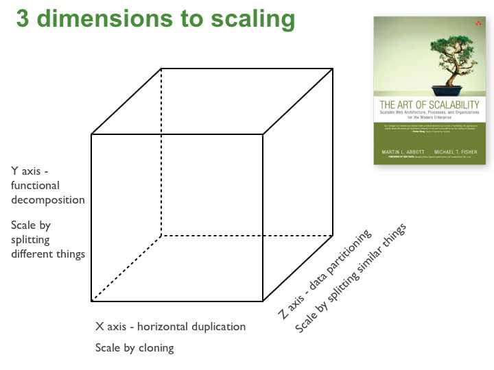

# Microservice Architecture

## What Is Microservices

**_Microservice:_** Service oriented architecture composed of loosely coupled elements of bounded contexts.

## Refactor Monolithic Application To Use Microservices

# Reference

1. **Richardson, Chris**, _Microservices Patterns: With Examples in Java (2019)_, Manning Publications.
2. **Baptista, Gabriel; Abbruzzese, Francesco**, _Software Architecture With C# 9 And .NET 5 (2020)_, Packt Publishing.
3. [Chris Richardson Microservices Blog](https://microservices.io/)
